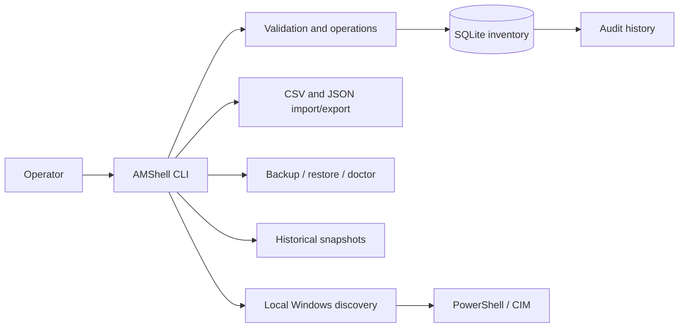

# AMShell

**Asset Management Shell** — a Python CLI for local IT asset inventory, lifecycle management, recovery, health checking and point-in-time inventory history.

AMShell is an infrastructure-focused learning and portfolio project. It tracks authorised or fictional devices through lifecycle states such as in stock, assigned, repair, loan, retired and disposed while emphasising data integrity, auditability, recovery and safe operational boundaries.

> **Release status:** `2.0.0rc1` release candidate. Intended for lab and portfolio use, not as a production enterprise asset-management platform.

## What AMShell demonstrates

- Local SQLite inventory persistence.
- Asset and serial-number validation with uniqueness controls.
- Audited field edits and lifecycle transitions.
- CSV import/export and versioned JSON export.
- Warranty and asset-age reporting.
- Read-only local Windows hardware discovery using PowerShell/CIM.
- Controlled comparison of stored inventory with observed local hardware.
- Verified SQLite backup, restore and health checks.
- Point-in-time JSON inventory snapshots, diffing, retention and freshness monitoring.
- Pytest and Ruff quality gates across Python 3.11, 3.12 and 3.13.
- Packaged CLI smoke testing in GitHub Actions.

## Architecture



See [docs/architecture.md](docs/architecture.md) for design choices and scope boundaries.

## Requirements and development install

AMShell requires Python 3.11 or newer.

```bash
python -m venv .venv
```

Windows PowerShell:

```powershell
.\.venv\Scripts\Activate.ps1
python -m pip install --upgrade pip
pip install -e ".[dev]"
```

Linux/macOS:

```bash
source .venv/bin/activate
python -m pip install --upgrade pip
pip install -e ".[dev]"
```

For a clean non-editable install matching the package smoke test:

```bash
python -m pip install .
amshell --help
```

## Quick start

```bash
amshell init
amshell import-csv examples/assets.example.csv
amshell list
amshell search LabBook
amshell show AST001
amshell summary
```

Add or update an asset:

```bash
amshell add --purchase-date 2026-01-15 --warranty-expiry 2029-01-15
amshell edit AST001 --location "Bench 2" --reason "Device moved"
amshell status AST001 repair --reason "Battery fault"
amshell history AST001
```

Export and report:

```bash
amshell export-csv exports/assets.csv
amshell export-json exports/assets.json
amshell warranty --days 90
amshell report
amshell report --format json
```

## Command map

| Command | Purpose |
| --- | --- |
| `amshell init` | Initialise the local SQLite database. |
| `amshell list` | List assets, optionally filtered by status or device type. |
| `amshell add` | Add an asset with validated inventory fields. |
| `amshell show <tag>` | Show full details for one asset. |
| `amshell edit <tag>` | Edit approved fields and write field-level audit history. |
| `amshell search <term>` | Search tags, hostnames, hardware, assignment and location. |
| `amshell status <tag> <state>` | Change lifecycle state with an audit reason. |
| `amshell history <tag>` | Show the audit history for an asset. |
| `amshell summary` | Show inventory counts by lifecycle state. |
| `amshell warranty` | Report expired and soon-to-expire warranties. |
| `amshell report` | Produce an operational inventory report in table or JSON format. |
| `amshell import-csv <file>` | Import sanitised inventory records from CSV. |
| `amshell export-csv <file>` | Export current inventory as CSV. |
| `amshell export-json <file>` | Export current inventory in versioned JSON format. |
| `amshell discover` | Read local Windows hardware/OS information without changing inventory. |
| `amshell discover --add` | Add the discovered local device after explicit operator input. |
| `amshell compare <tag>` | Compare a stored asset with local Windows discovery data. |
| `amshell compare <tag> --update` | Reconcile safe descriptive drift only when serial identity matches. |
| `amshell backup` | Create and verify a local SQLite backup. |
| `amshell backup list` | List available local backups. |
| `amshell backup verify <file>` | Run SQLite integrity checking against a backup. |
| `amshell restore <file>` | Restore a verified backup after creating a safety backup. |
| `amshell doctor` | Run operational checks against the local installation and backups. |
| `amshell snapshot create` | Create a point-in-time inventory snapshot. |
| `amshell snapshot list` | List valid historical snapshots. |
| `amshell snapshot diff <old> <new>` | Compare two historical snapshots. |
| `amshell snapshot prune` | Preview retention actions; deletion requires `--apply`. |
| `amshell snapshot status` | Check whether the newest valid snapshot is fresh enough. |

Use `amshell <command> --help` for command-specific options.

## Backup and recovery

Create a verified backup:

```bash
amshell backup
amshell backup list
amshell backup verify backups/<backup-file>.db
```

Restore deliberately:

```bash
amshell restore backups/<backup-file>.db
```

A restore creates a pre-restore safety backup of the live database first. See [docs/backup-and-recovery.md](docs/backup-and-recovery.md).

## Operational health

```bash
amshell doctor
amshell doctor --max-backup-age 7
```

The doctor command checks the local installation and backup state and returns a non-zero exit code when a failure is detected. See [docs/doctor.md](docs/doctor.md).

## Historical snapshots and automation

Create and inspect point-in-time inventory history:

```bash
amshell snapshot create
amshell snapshot list
amshell snapshot diff snapshots/<older>.json snapshots/<newer>.json
```

Retention is preview-first:

```bash
amshell snapshot prune
amshell snapshot prune --keep 30 --older-than-days 30
amshell snapshot prune --keep 30 --older-than-days 30 --apply
```

Check snapshot freshness for scheduled workflows:

```bash
amshell snapshot status --max-age-hours 36
```

Scheduler examples are provided for Windows Task Scheduler and cron, but AMShell deliberately does not install scheduled jobs itself. See [docs/snapshots.md](docs/snapshots.md), [docs/snapshot-retention.md](docs/snapshot-retention.md) and [docs/snapshot-automation.md](docs/snapshot-automation.md).

## Windows discovery and drift comparison

On Windows, `amshell discover` performs read-only local discovery using constrained CIM queries. It does not accept a remote computer name, credentials or arbitrary PowerShell commands.

```powershell
amshell discover
amshell compare AST001
```

`amshell compare AST001 --update` only reconciles safe descriptive fields when the discovered BIOS serial matches the stored asset identity. See [docs/inventory-drift.md](docs/inventory-drift.md).

## Testing and release quality

Local development checks:

```bash
ruff check amshell tests
pytest -q
```

GitHub Actions runs lint and tests across Python 3.11, 3.12 and 3.13. A separate package-smoke job installs AMShell non-editably with `pip install .` and verifies the main CLI, backup, doctor and snapshot command surfaces.

## Security and privacy

The default SQLite database, CSV/JSON exports, backups, snapshots and environment files are local operational data and should not be committed. Public examples must contain fictional Astra lab data only.

Do not commit real organisational inventories, serial numbers, usernames, internal locations, credentials or other confidential operational information. Windows discovery can expose a real device serial number in terminal output, so screenshots and copied output must be sanitised before publication.

The private development archive contains legacy history that must not be exposed directly. Public distribution should use a verified clean-history repository, as documented in [docs/release-readiness.md](docs/release-readiness.md) and [docs/history-remediation.md](docs/history-remediation.md). If you are reading this from the clean public distribution, keep future commits free of real organisational inventory and other sensitive operational data.

See [SECURITY.md](SECURITY.md).

## Project documentation

- [Architecture](docs/architecture.md)
- [Backup and recovery](docs/backup-and-recovery.md)
- [Doctor / health checks](docs/doctor.md)
- [Inventory drift](docs/inventory-drift.md)
- [JSON export](docs/json-export.md)
- [Operational reporting](docs/reporting.md)
- [Historical snapshots](docs/snapshots.md)
- [Snapshot retention](docs/snapshot-retention.md)
- [Snapshot automation](docs/snapshot-automation.md)
- [Release readiness](docs/release-readiness.md)
- [Changelog](CHANGELOG.md)

## Release direction

The v2 release candidate intentionally prioritises the local CLI, data integrity, recovery, auditability and operational visibility over adding a GUI or remote service. New features should remain controlled and infrastructure-focused rather than expanding scope simply for feature count.

## Portfolio context

AMShell complements the [Astra Infrastructure Lab](https://github.com/localhostjohn/astra-infrastructure-lab) by demonstrating the engineering of a small operational infrastructure tool: validated asset data, lifecycle history, Windows discovery, drift checking, backup/recovery, health checks and historical inventory snapshots.

All public-facing examples must use fictional or personal lab data. No employer infrastructure, production inventories, credentials or internal configuration should be published.

Maintained by John Weekes as part of an infrastructure and cloud engineering learning portfolio.
