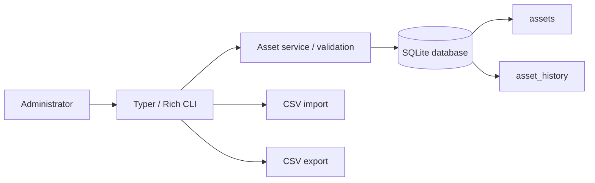

# AMShell Architecture

AMShell is intentionally small: a local Python CLI sits over an SQLite inventory database and records lifecycle changes in a separate audit-history table.

## Design choices

### SQLite as the system of record

SQLite replaces the original CSV-only storage because it provides durable records, uniqueness constraints, transactional updates and a better base for search and audit history without requiring an external database server.

### CSV as interchange only

CSV remains useful for importing and exporting sanitised inventory data. Local exports are excluded from Git by default.

### Explicit lifecycle state

Assets use one of the following lifecycle states:

- `in-stock`
- `assigned`
- `repair`
- `loan`
- `retired`
- `disposed`

Status changes are recorded in `asset_history` with the old state, new state, reason and timestamp.

### Local-first security boundary

The current release has no network listener, no cloud dependency and no authentication layer. It is intended for a single authorised local operator in a lab environment. Multi-user authentication, RBAC and remote APIs are outside the current scope.

## Future work

- Editable non-status asset fields with audit history.
- Windows inventory discovery using safe read-only CIM queries.
- Warranty-expiry reporting.
- Backup and restore commands for the local SQLite database.
- Optional JSON export.
- More comprehensive CLI integration tests.
